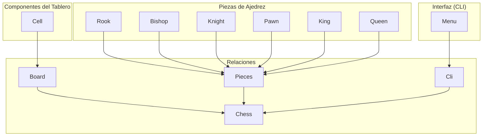

# ♟ Ajedrez - Augusto Giuffrida

El ajedrez es un juego de estrategia donde dos jugadores se enfrentan en un tablero de 8×8 casillas. Cada jugador controla 16 piezas: un rey, una reina, dos torres, dos caballos, dos alfiles y ocho peones. El objetivo es capturar al rey del oponente. Este proyecto implementa el juego de ajedrez en Python con una interfaz de línea de comandos (CLI) interactiva.

## 📖 Contenidos
- 📜[Reglas](#-reglas)
- 🚀[Instalación](#-instalación)
- 🎮[Cómo jugar](#-cómo-jugar)
- 🏅[Estado del Proyecto](#-estado-del-proyecto)
- 🛠️[Diagrama de Clases](#-diagrama-de-clases)
- 👨‍🎓[Alumno](#-alumno)

## 📜 Reglas

- **Movimientos de las piezas**:
  - ♔ **Rey**: se mueve una casilla en cualquier dirección.
  - ♕ **Reina**: se mueve cualquier número de casillas en cualquier dirección.
  - ♖ **Torre**: se mueve en línea recta, vertical u horizontal.
  - ♗ **Alfil**: se mueve en diagonal.
  - ♘ **Caballo**: se mueve en forma de "L".
  - ♙ **Peón**: se mueve hacia adelante, captura en diagonal.

📚 Puedes consultar una guía completa de las reglas del ajedrez [aquí](https://es.wikipedia.org/wiki/Ajedrez).

## 🚀 Instalación

Clona el repositorio para obtener el código fuente del proyecto:

```bash
git clone https://github.com/um-computacion-tm/ajedrez-2024-AugustoGiuffrida.git
```

## 🎮 Cómo jugar

1. Crear la imagen:

```bash
docker buildx build --no-cache -t <nombre_imagen> .
```

2. Ejecutar la imagen:

```bash
docker run -it <nombre_imagen>
```


## 🏅 Badges


| *_CircleCI_* | *_Main branch_* | *_Develop branch_* |
| :---:   | :---:   | :---: |
| Status | [](https://dl.circleci.com/status-badge/redirect/gh/um-computacion-tm/ajedrez-2024-AugustoGiuffrida/tree/main) | [](https://dl.circleci.com/status-badge/redirect/gh/um-computacion-tm/ajedrez-2024-AugustoGiuffrida/tree/develop) |

| _*Codeclimate*_ | *_Coverage_* | *_Maintainability_* |
| :---:   | :---:   | :---: |
| Status | [](https://codeclimate.com/github/um-computacion-tm/ajedrez-2024-AugustoGiuffrida/maintainability) | [](https://codeclimate.com/github/um-computacion-tm/ajedrez-2024-AugustoGiuffrida/test_coverage) |


## 🛠️ Diagrama de Clases




## 👨‍🎓 Alumno

Nombre: Augusto Giuffrida

Legajo: 60137


