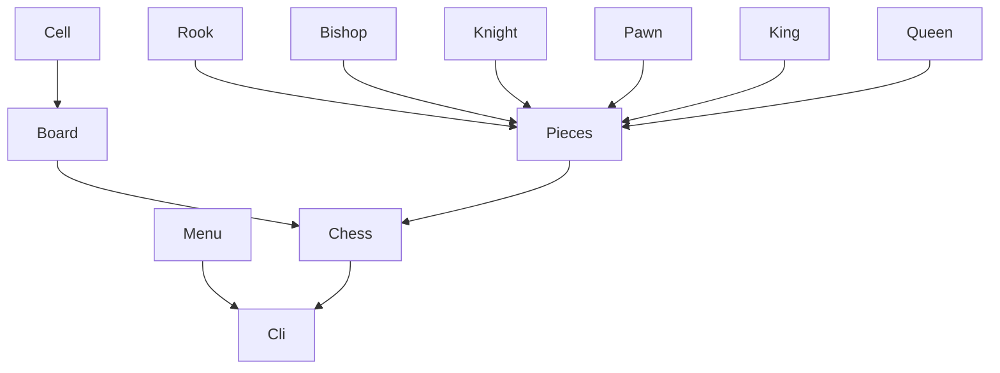

# Ajedrez-Augusto Giuffrida

Flujo de clases
Aquí tienes un simple flujo de comunicación entre clases:

## Classes work flow

| **Metric**        | **Badge**|
|-------------------|------------------|
| **CircleCI**      |  |
| **Maintainability** | |
| **Test Coverage**  | |

