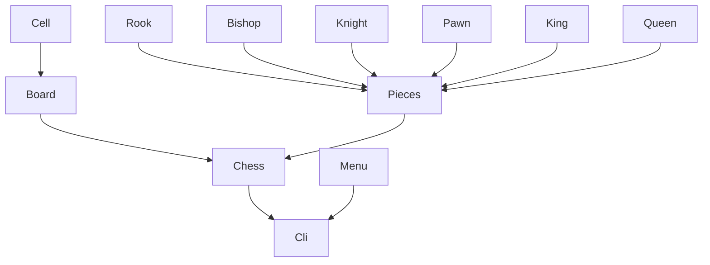

# Ajedrez-Augusto Giuffrida

El ajedrez es un juego de estrategia entre dos jugadores que se enfrentan en un tablero de 8×8 casillas. Cada jugador controla un conjunto de 16 piezas: un rey, una reina, dos torres, dos caballos, dos alfiles y ocho peones. El objetivo del juego es dar jaque mate al rey del oponente.

## Reglas

- **Movimientos de las piezas**:
  - **Rey**: se mueve una casilla en cualquier dirección.
  - **Reina**: se mueve cualquier número de casillas en cualquier dirección.
  - **Torre**: se mueve cualquier número de casillas en línea recta, vertical u horizontal.
  - **Alfil**: se mueve cualquier número de casillas en diagonal.
  - **Caballo**: se mueve en forma de "L", dos casillas en una dirección y una en perpendicular.
  - **Peón**: se mueve una casilla hacia adelante, y captura en diagonal.
  

Puedes consultar una guía completa de las reglas del ajedrez [aquí](https://es.wikipedia.org/wiki/Ajedrez).

## Descarga

```bash
git clone https://github.com/tu_usuario/ajedrez-augusto-giuffrida.git
```

## Ejecutar el juego

```python
python3 -m game.cli
```

## Badges

| **Metric**        | **Badge**|
|-------------------|------------------|
| **CircleCI**      | [](https://dl.circleci.com/status-badge/redirect/gh/um-computacion-tm/ajedrez-2024-AugustoGiuffrida/tree/main) |
| **Maintainability** | [](https://codeclimate.com/github/um-computacion-tm/ajedrez-2024-AugustoGiuffrida/maintainability)|
| **Test Coverage**  | [](https://codeclimate.com/github/um-computacion-tm/ajedrez-2024-AugustoGiuffrida/test_coverage)|

## Classes work flow




